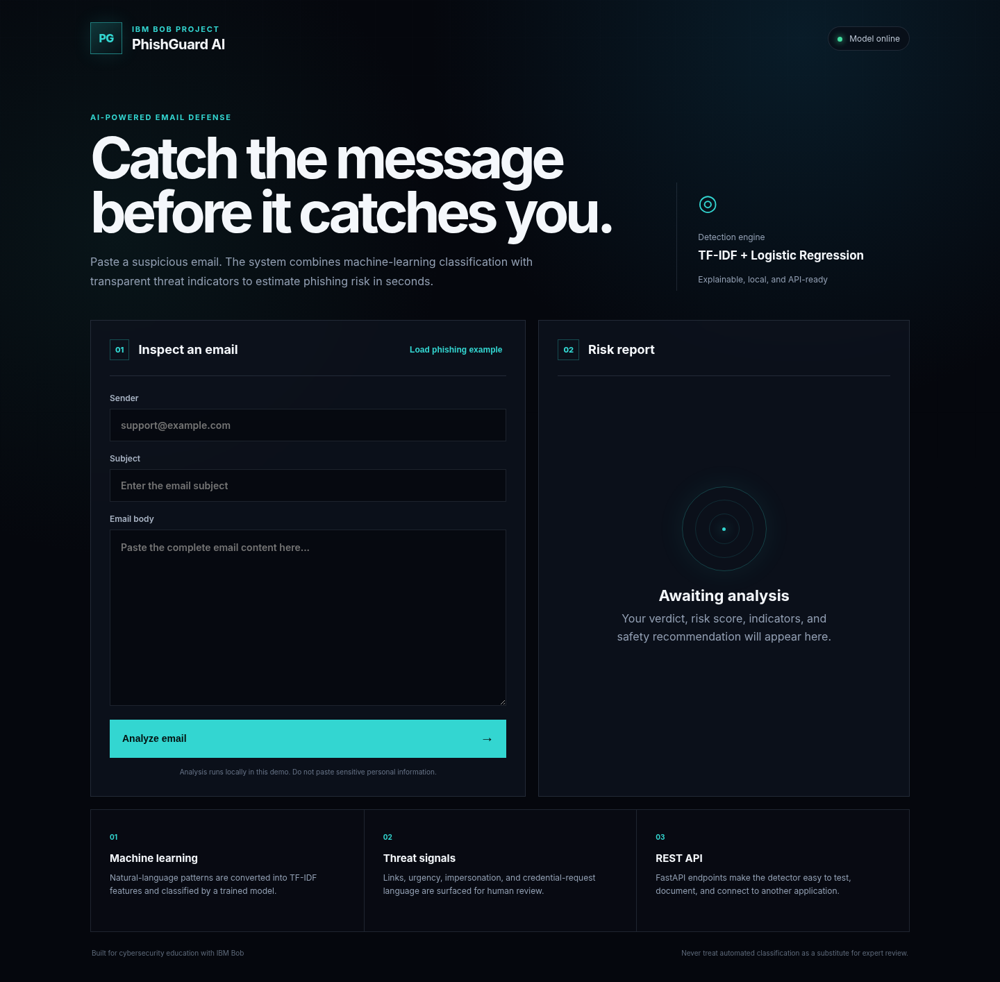
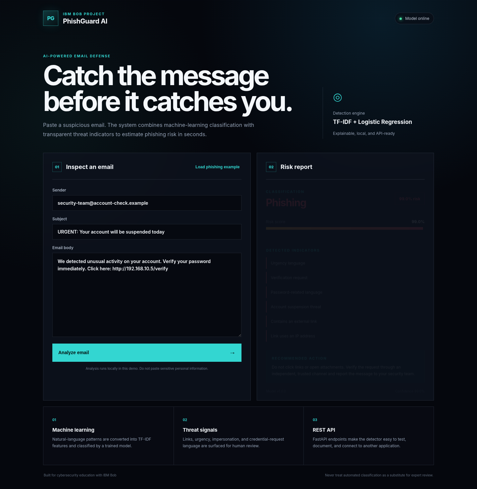
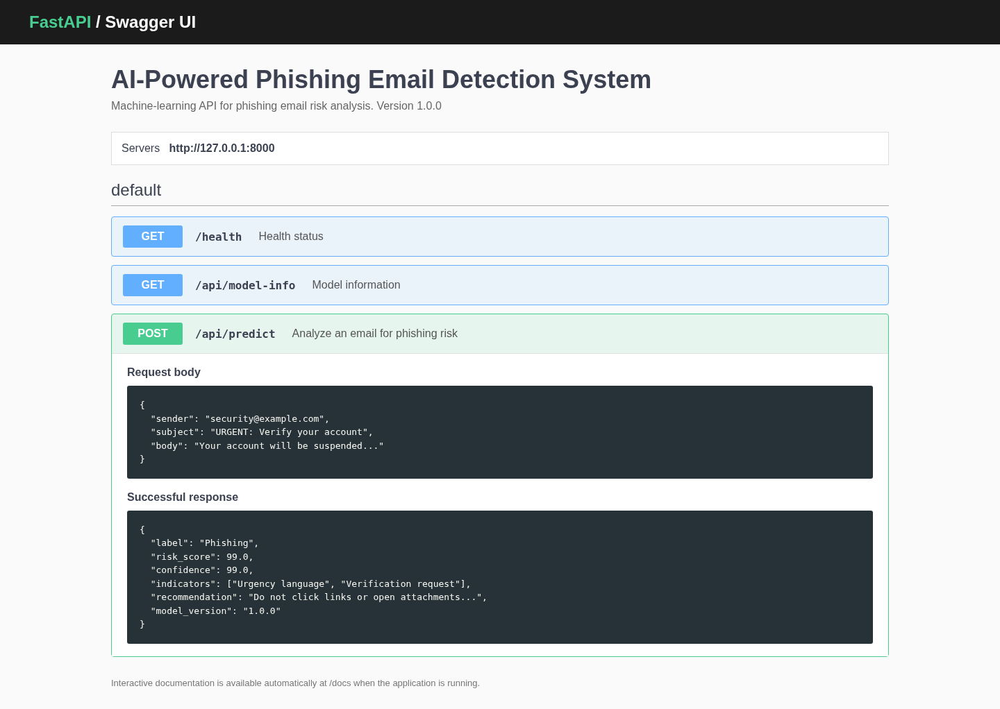

# AI-Powered Phishing Email Detection System Using IBM Bob

A complete cybersecurity demonstration project that classifies email text as **Phishing** or **Legitimate**, calculates a risk score, surfaces explainable warning indicators, and returns a safe action recommendation.

> This project is designed to be opened, reviewed, tested, and extended in **IBM Bob**. It includes `AGENTS.md`, ready-to-use Bob tasks, automated tests, GitHub Actions, Docker support, and project screenshots.



## Problem statement

Phishing messages use urgency, impersonation, suspicious links, and credential requests to pressure users into acting before they verify the sender. The goal of this project is to provide a fast educational screening layer that combines machine learning with visible, human-readable indicators.

## Features

- TF-IDF text features with Logistic Regression classification
- Sender, subject, and email-body analysis
- Risk score and model confidence
- Transparent indicators for urgency, links, impersonation, and credential language
- Responsive cybersecurity dashboard
- REST API with automatic Swagger documentation
- Reproducible local training
- FastAPI tests and GitHub Actions CI
- Docker and Docker Compose support
- IBM Bob `AGENTS.md` and task prompts

## Screenshots

| Dashboard | Phishing result | API documentation |
|---|---|---|
|  |  |  |

## Technology stack

- Python 3.12
- FastAPI
- scikit-learn
- pandas
- HTML, CSS, JavaScript
- pytest
- Docker
- GitHub Actions

## Quick start

### One-click Windows start

Double-click `START_WINDOWS.bat`. It creates the virtual environment, installs packages, trains the model, opens the browser, and starts the server.


### Windows PowerShell

```powershell
python -m venv .venv
.\.venv\Scripts\Activate.ps1
python -m pip install --upgrade pip
pip install -r requirements.txt
python scripts\train_model.py
uvicorn app.main:app --reload
```

Open:

- Dashboard: `http://127.0.0.1:8000`
- Swagger API docs: `http://127.0.0.1:8000/docs`
- Health endpoint: `http://127.0.0.1:8000/health`

### macOS or Linux

```bash
python3 -m venv .venv
source .venv/bin/activate
python -m pip install --upgrade pip
pip install -r requirements.txt
python scripts/train_model.py
uvicorn app.main:app --reload
```

## Run tests

```bash
pytest -q
```

## API example

```bash
curl -X POST http://127.0.0.1:8000/api/predict \
  -H "Content-Type: application/json" \
  -d '{
    "sender": "security@account-check.example",
    "subject": "URGENT: Verify your account",
    "body": "Your account will be suspended. Confirm your password now at http://192.168.1.8/verify"
  }'
```

Example response:

```json
{
  "label": "Phishing",
  "risk_score": 99.0,
  "confidence": 99.0,
  "indicators": [
    "Urgency language",
    "Verification request",
    "Password-related language",
    "Account suspension threat",
    "Contains an external link",
    "Link uses an IP address"
  ],
  "recommendation": "Do not click links or open attachments. Verify the request through an independent, trusted channel and report the message to your security team.",
  "model_version": "1.0.0"
}
```

## Use with IBM Bob

1. Extract or clone this repository.
2. Open the project folder in IBM Bob IDE.
3. Switch the agentic chat to **Code mode**.
4. Run `/init` so Bob reads the repository and creates or refreshes project context.
5. Ask Bob to follow `AGENTS.md`.
6. Paste **Task 1** from `BOB_PROMPTS.md`.
7. Keep command approval enabled while Bob works, especially for installs and file changes.
8. Capture screenshots of the workspace, Bob task completion, running dashboard, Swagger docs, and passing tests.

## GitHub publishing

```bash
git init
git add .
git commit -m "Build AI phishing email detection system with IBM Bob"
git branch -M main
git remote add origin https://github.com/YOUR_USERNAME/ai-phishing-email-detection-ibm-bob.git
git push -u origin main
```

Replace `YOUR_USERNAME` and create the empty GitHub repository before pushing.

## Dataset note

The included CSV is a small, fictional demonstration dataset. It is enough to run and present the workflow, but not enough for a production security product. Real deployment requires a larger licensed dataset, independent validation, privacy controls, model calibration, and human review.

## Ethical and security limitations

- The detector can produce false positives and false negatives.
- Never click suspicious links merely to test them.
- Do not upload private or regulated email content to an untrusted deployment.
- Do not treat this tool as a replacement for trained security staff.
- The sample URLs and identities are fictional or use reserved example domains.

## IBM Bob certificate

This repository proves project implementation, not certification. An IBM Bob certificate or badge must be legitimately earned or issued through the applicable official IBM learning program or event. Do not create or submit a fake certificate.

## License

MIT License. See `LICENSE`.
