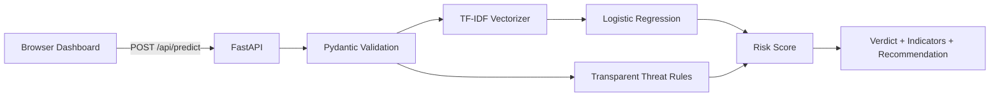

# Architecture

## Detection flow

1. The browser sends sender, subject, and body text to the API.
2. Pydantic validates length and required fields.
3. The trained pipeline produces a phishing probability.
4. A small transparent rule layer surfaces recognizable warning signs.
5. The API returns a risk score, classification, indicators, and safety guidance.

## Production hardening roadmap

- Replace the demonstration dataset with a larger, reviewed, licensed corpus.
- Add MIME and attachment metadata parsing without opening unsafe content.
- Add sender-domain authentication signals such as SPF, DKIM, and DMARC results.
- Calibrate thresholds against an independent validation set.
- Add authentication, rate limiting, audit controls, and privacy retention policies.
- Deploy behind HTTPS with secrets managed by the hosting platform.
